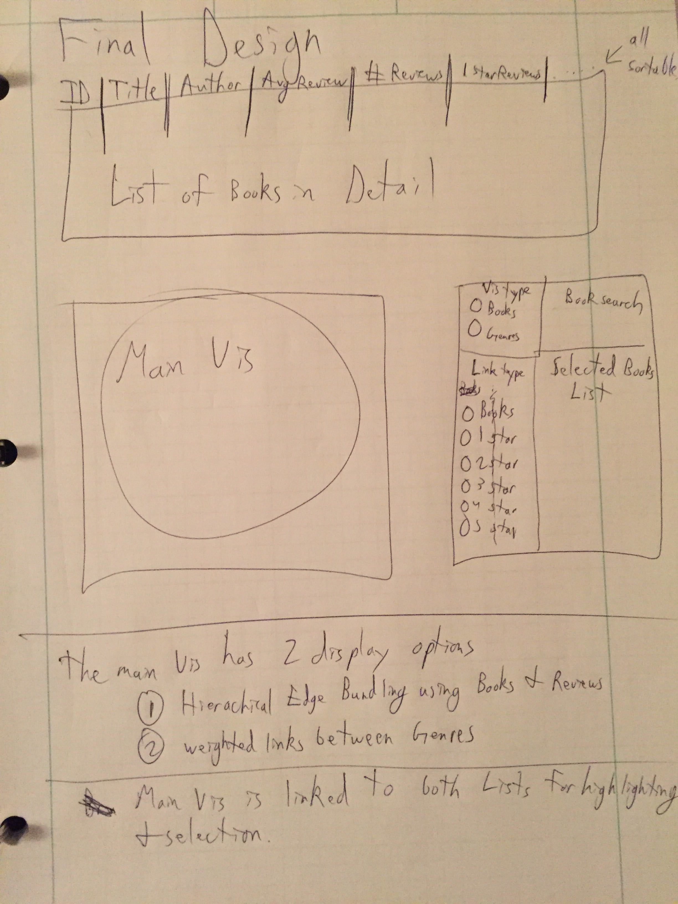

# On The Board Final Project Proposal
## Team Info 

| Name      |       Email         | Github Username  |
|---|:---:|---:|
| Jason Andersen | jasonandersen00@aggiemail.usu.edu | JasonRAndersen00 |
| Will Bowden   | willbowden37@gmail.com       | willbowden37   |
| Joseph Turcotte | joe.turcotte96@gmail.com      | JoeTurc      |

## Project Background
I think we did what every team did. We started looking around at possible datasets. We really didn't want to make our own, because of the availability of so many good ones. We cycled through energy data, such as fuel consumption, and we thought about comparing it to modes of transport in an area. We looked at world development indicators, and tried to think of good correlations. The problen with having too many datasets is that it can become easy to draw false correlations. But then we found the goodreads dataset. Someone had used the goodreads API to compile book data of the 10,000 most popular books, and put them into a csv file. They also compiled some of the user comments, and they compiled the tags. All three of the group members enjoy reading boks, so we decided that this dataset would be fun to use, and interesting to visualize.

## Project Objectives
Our objective for this project changed over time. Initially, after a discussion with Dr. Edwards, we were going to make it into a book suggestion tool. A user could input books they like and dislike, and the tool would shoot out a suggested genre, or author, or book. The problem with this, is it's already done very well on Amazon, and Goodreads. Why remake something already done very well. Plus, those suggestion lists run on powerful cloud based AI's. We have neither the time nor means to construct a tool like that. In our planning session, we hit on the purpose. It's not to make suggestions, it's to visualize trends in the data. In essence, we are visualizing what the AI does and then the user can come to their own conclusions based on that data.

## Data Source
If need be, we can use the Goodreads API for additional data. Unfortunately, their developer API only allows for one request per second. This is far below a usable request load. So the bulk of our data will come from zygmuntz Github <a href="https://github.com/zygmuntz/goodbooks-10k">goodbooks-10k</a>

## Data Processing
There are a few csv file that we need to go through in order to make sure we have good data. From initial inspection, books.csv will not require much cleanup, ratings.csv will be about the same, although it is quite large. The one that will take some doing is the tags.csv. This file has every tag imaginable, including non-english tags. For the purposes of the visualization, we will have to pick only a few of the tags, which will require some checking to makee sure every book is covered by the tags we choose to use.

## Visualization Design

- Brainstorming session - Figure 1
- Design 1 Edge bundling - Figure 2
- Design 2 Node link diagram - Figure 3
- Design 3 Edge bundling with stacked bar charts - Figure 4
- Final design Edge bundling with different edges - Figure 5
## Must-Have Features
We need a way to display the links between books. On one main panel, we will have links between books, based on reviewers, of any single number of stars given, ie. the user can choose to display connections based on one star, or two star, etc. Another important feature is the ability to choose speccific books to see connections between your choice of books. The user must be able to see their chosen list, and bee able to add and delete easily.

## Optional Features
A stretch goal would be to have a secondary main display. The books themselves would disappear, and the links would be wieghted links, where the width would be based on the number of reviewers in both genres. Another feature would be to use a color gradient on the lines themselves, so they could be traced from one end to the other.

## Project Schedule
- Saturday Nov 16 -- HTML Layout done
- Saturday Nov 23 -- Initial Vis completed
- Saturday Nov 30 -- Only main panel left
- Saturday Dec 7 -- Vis Completed

## Figures
- ### Figure 1

- ### Figure 2

- ### Figure 3

- ### Figure 4

- ### Figure 5
