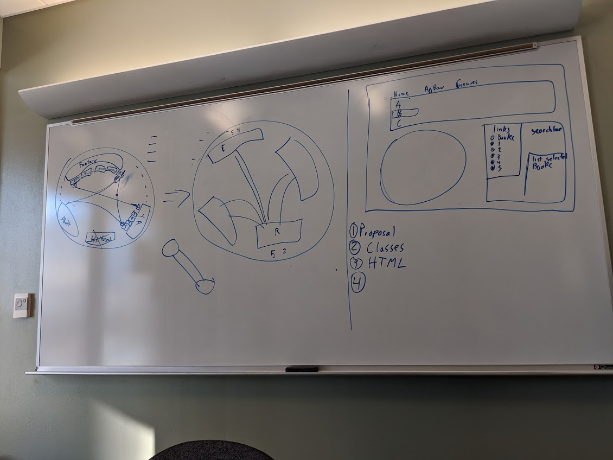
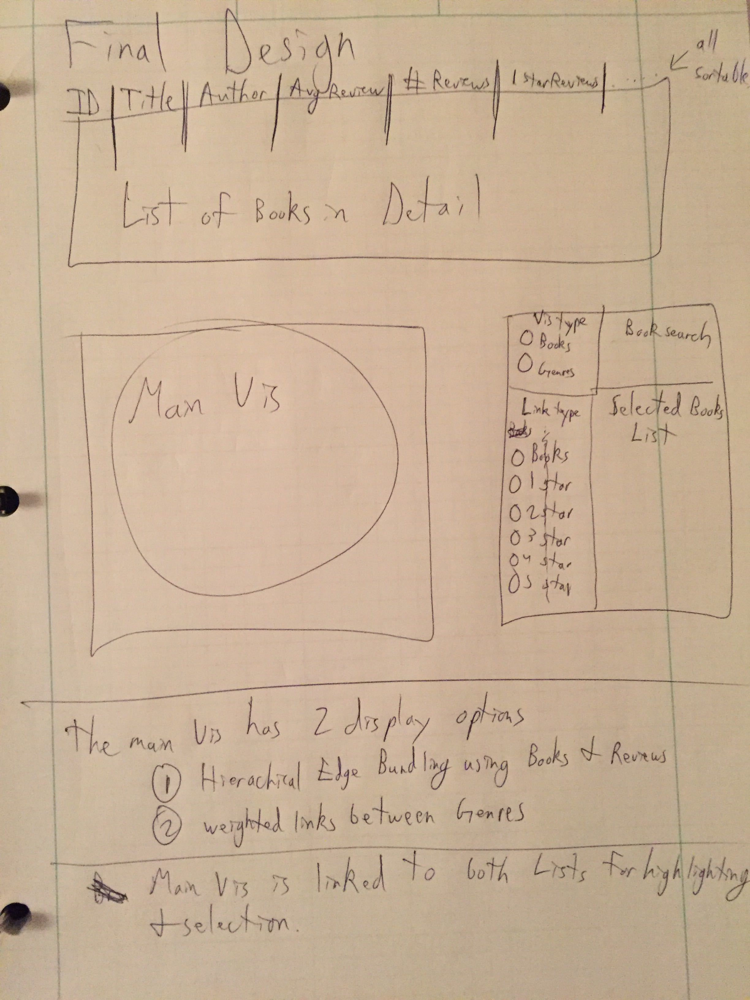
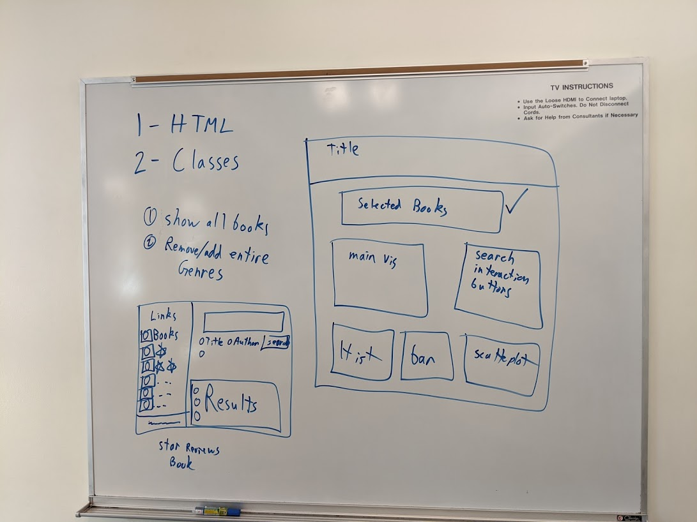
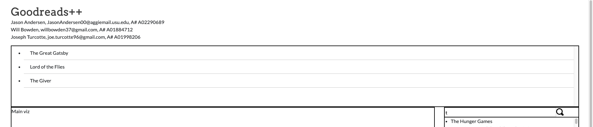
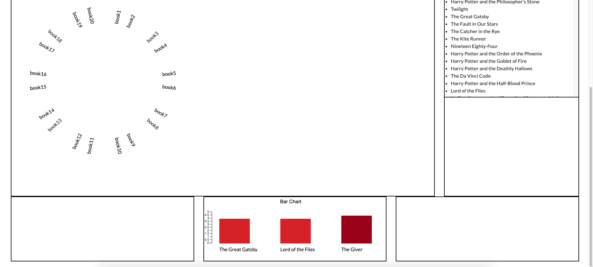

# Process Book

## Team Info 

| Name      |       Email         | Github Username  |
|---|:---:|---:|
| Jason Andersen | jasonandersen00@aggiemail.usu.edu | JasonRAndersen00 |
| Will Bowden   | willbowden37@gmail.com       | willbowden37   |
| Joseph Turcotte | joe.turcotte96@gmail.com      | JoeTurc      |  

## Overview and Motivation
Our group loves to read books, but sometimes it is hard to find good books. 
Various people have made lists of the "best books," but different people have different tastes. 
However, if you have similar tastes to someone in multiple categories, it is more likely that you might
like something else that that person does.  

The intent of this project is to create a visualization system that connects all kinds of books of
different genres according to who read and reviewed them. We accomplish this by using a Hierarchical Edge
Bundling visualization as well as a few others that supplement it. The goal of this is to make it easier to
find books that other people with similar tastes like as well. For example, if you like both Brandon
Sanderson and J.R.R. Tolkien, you could use this visualization to find other authors liked by people
who enjoy both of those authors.

## Related Work
We were inspired to use a Hierarchical Edge Bundling visualization after one was shown in class. We had
been trying to come up with ways that we could connect different kinds of books that people of different
tastes like, and when we decided that it would be the ideal way for us to represent our data.

## Questions
The biggest question we are trying to answer is help people find new kinds of books that people with
similar tastes also tend to like. Plenty of websites like Amazon make recommendations based on users
that have read similar books, but there is no substitute to allowing people to make connections themselves.

Another question we are trying to answer are what the connections in review scores of different genres
look like. A lot of people who enjoy fantasy also enjoy science fiction, but do they enjoy romance as well?
Questions like these are not easy to answer with a simple recommendation system, but with a visualization
like ours, further analysis can be done by users looking for more information.

## Data
We are using a data source on Github that originated from the Goodreads API. It is from a user called zygmuntz
and is in a repository called <a href="https://github.com/zygmuntz/goodbooks-10k">goodbooks-10k</a>.

If we need additional data, we can use the Goodreads API directly. Unfortunately, there are some limitations
with this API like needing elevated permissions to access certain things and only being able to make one
API request per second that caused us to find another data source that had the data we needed statically.

## Exploratory Data Analysis
Most of our early interaction with the data came in list form. In retrospect, this was not the most
useful way for us to look at the data as it did not allow us to see trends in the dataset. The biggest
insight gained from looking through these lists was the number of tags that were on each piece of data
that we needed to filter through.
 
As we went along we did interact with the data in the form of some simple bar charts that made it easier
to see things. However, as our visualization is far more about the connections between categorical data
rather than quantitative analysis, there was no substitute to making a prototype of the Hierarchical Edge
Bundling visualization.

## Design Evolution
Our original plan was to use a node link diagram. It would have links between the different books for
each reviewer who had reviewed both of them. The links would have gotten thicker based on the numbers of
reviewers who had reviewed both. This would have been a fine visualization, but we decided against it once
we saw the Hierarchical Edge Bundling chart in class

After we had decided on using Hierarchical Edge Bundling, we still had a lot of different questions to
answer. The biggest was what data we wanted to show in our bundled graph. We experimented with genres,
ratings, authors, and lots of other things. This is also the stage where we came up with the search box
on the right and the list above of the selected books.

For our proposal, we brought a lot of the different things we had been thinking of together in a more
concrete design. As you can see here, most of the elements used eventually made it to the prototype stage.
The biggest thing that was cut was changing the table into a simple list since the focus of this data
should be on teh visualization, not a table.

By the time we reached the prototyping stage, we had narrowed in on the layout we wanted to use. This is
also the stage where we decided to use supplementary visualizations to support the main viz. These were
placed underneath the main viz so as not to distract from the main viz. While perspective is important in
visual art, it would be detrimental to visualizing data to have these smaller visualizations distract from
the Hierarchical Edge Bundling chart that is the focus of our implementation.

This prototype formed the basis for our implementation(shown and explained in the next section). The
process of iterating through these design stages was quite useful in improving the final design. By
communicating with each other as well as with our professor, we were able to create a sophisticated
design to implement this visualization.

## Implementation
The intent of the main viz is to show the connections between different books. In the final version of
this visualization, the user will be able to change the books shown in it from the search box on the right.

The search box on the right allows the user to search through the possible books. By clicking on a book
in the results list, it will be added to all of the visualizations as well as the list at the top, which
represents all the books currently selected.

At the bottom are 3 supplementary visualizations, a histogram, a bar char, and a scatterplot. For the
prototype, only the bar chart has been implemented. It shows The average score of each book selected and
resizes itself based on the number of books selected. As the viz evolves, it will eventually show more
information like the average scores of genres as well.

## Evaluation
The biggest thing we learned from our visualizations was just how interconnected the data really is. A
user who has reviewed one book has also likely reviewed countless others. Likewise, many books share
similar tags and have scores in the same ballpark as similar books, likely as a result of the same
people reviewing them.

This helped to answer our biggest question which was to find connections between different books that are
enjoyed by the same people. The visualization connects these different points and presents it in a way
that is discernible by a user.

As our visualization is still in the prototype stage, there are various different issues. The biggest one
is that the main visualization only works when it is hard coded and currently does not accept dynamic
input. One of the biggest ways to improve it beyond technical issues would be to add more options and
interactivity. If we give the users options to see different kinds of data from this same data source,
such as authors, genres, reviews, and tags, it could further improve the usefulness fo the visualization.
