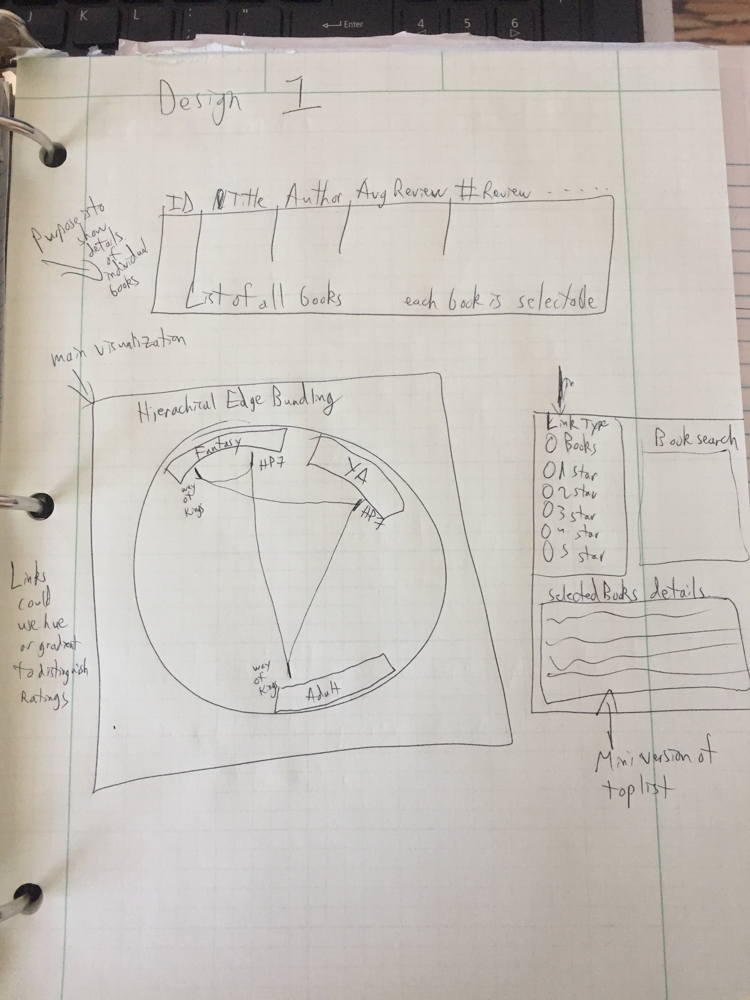
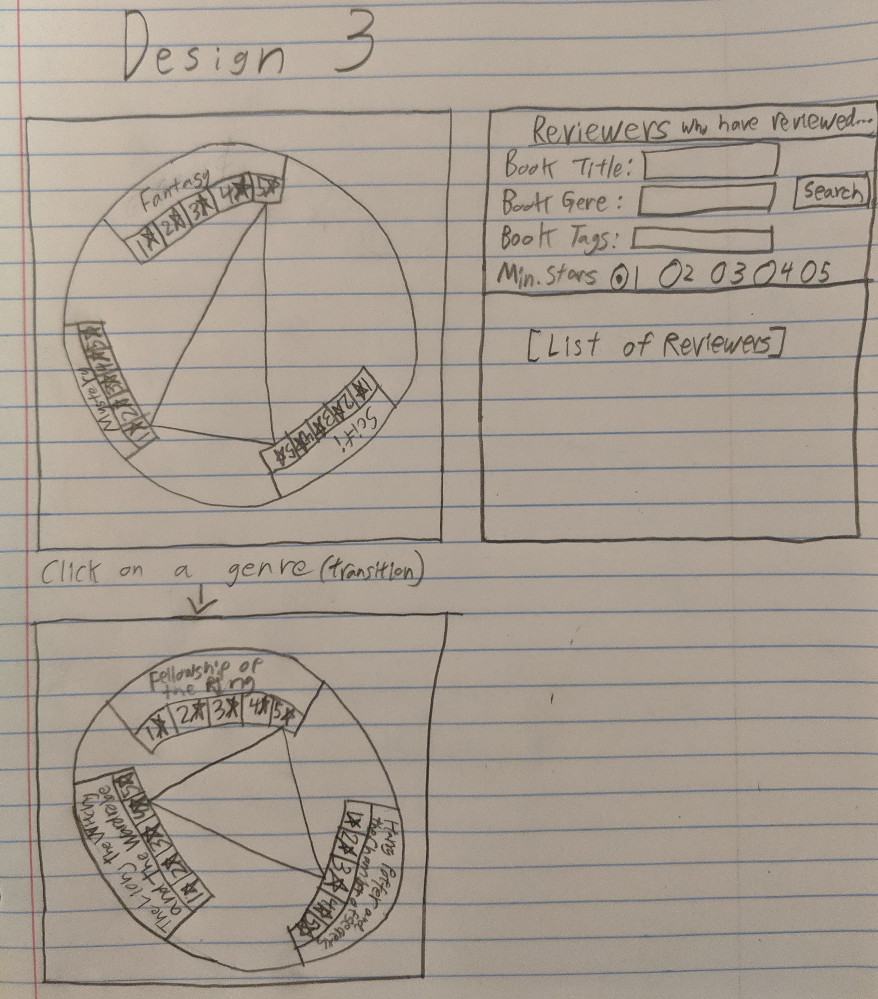

# On The Board Final Project

## Project Proposal
### Team Info 

| Name      |       Email         | Github Username  |
|---|:---:|---:|
| Jason Andersen | jasonandersen00@aggiemail.usu.edu | JasonRAndersen00 |
| Will Bowden   | willbowden37@gmail.com       | willbowden37   |
| Joseph Turcotte | joe.turcotte96@gmail.com      | JoeTurc      |

### Project Background
I think we did what every team did. We started looking around at possible datasets. We really didn't want to make our own, because of the availability of so many good ones. We cycled through energy data, such as fuel consumption, and we thought about comparing it to modes of transport in an area. We looked at world development indicators, and tried to think of good correlations. The problen with having too many datasets is that it can become easy to draw false correlations. But then we found the goodreads dataset. Someone had used the goodreads API to compile book data of the 10,000 most popular books, and put them into a csv file. They also compiled some of the user comments, and they compiled the tags. All three of the group members enjoy reading boks, so we decided that this dataset would be fun to use, and interesting to visualize.

### Project Objectives
Our objective for this project changed over time. Initially, after a discussion with Dr. Edwards, we were going to make it into a book suggestion tool. A user could input books they like and dislike, and the tool would shoot out a suggested genre, or author, or book. The problem with this, is it's already done very well on Amazon, and Goodreads. Why remake something already done very well. Plus, those suggestion lists run on powerful cloud based AI's. We have neither the time nor means to construct a tool like that. In our planning session, we hit on the purpose. It's not to make suggestions, it's to visualize trends in the data. In essence, we are visualizing what the AI does and then the user can come to their own conclusions based on that data.

### Data Source
If need be, we can use the Goodreads API for additional data. Unfortunately, their developer API only allows for one request per second. This is far below a usable request load. So the bulk of our data will come from zygmuntz Github <a href="https://github.com/zygmuntz/goodbooks-10k">goodbooks-10k</a>

### Data Processing
There are a few csv file that we need to go through in order to make sure we have good data. From initial inspection, books.csv will not require much cleanup, ratings.csv will be about the same, although it is quite large. The one that will take some doing is the tags.csv. This file has every tag imaginable, including non-english tags. For the purposes of the visualization, we will have to pick only a few of the tags, which will require some checking to makee sure every book is covered by the tags we choose to use.

### Visualization Design

- Brainstorming session - Figure 1
- Design 1 Edge bundling - Figure 2
- Design 2 Node link diagram - Figure 3
- Design 3 Edge bundling with stacked bar charts - Figure 4
- Final design Edge bundling with different edges - Figure 5
### Must-Have Features
We need a way to display the links between books. On one main panel, we will have links between books, based on reviewers, of any single number of stars given, ie. the user can choose to display connections based on one star, or two star, etc. Another important feature is the ability to choose speccific books to see connections between your choice of books. The user must be able to see their chosen list, and bee able to add and delete easily.

### Optional Features
A stretch goal would be to have a secondary main display. The books themselves would disappear, and the links would be wieghted links, where the width would be based on the number of reviewers in both genres. Another feature would be to use a color gradient on the lines themselves, so they could be traced from one end to the other.

### Project Schedule
- Saturday Nov 16 -- HTML Layout done
- Saturday Nov 23 -- Initial Vis completed
- Saturday Nov 30 -- Only main panel left
- Saturday Dec 7 -- Vis Completed

### Figures
- #### Figure 1

- #### Figure 2

- #### Figure 3

- #### Figure 4

- #### Figure 5

## Process Book

### Overview and Motivation
Our group loves to read books, but sometimes it is hard to find good books. 
Various people have made lists of the "best books," but different people have different tastes. 
However, if you have similar tastes to someone in multiple categories, it is more likely that you might
like something else that that person does.  

The intent of this project is to create a visualization system that connects all kinds of books of
different genres according to who read and reviewed them. We accomplish this by using a Hierarchical Edge
Bundling visualization as well as a few others that supplement it. The goal of this is to make it easier to
find books that other people with similar tastes like as well. For example, if you like both Brandon
Sanderson and J.R.R. Tolkien, you could use this visualization to find other authors liked by people
who enjoy both of those authors.

### Related Work
We were inspired to use a Hierarchical Edge Bundling visualization after one was shown in class. We had
been trying to come up with ways that we could connect different kinds of books that people of different
tastes like, and when we decided that it would be the ideal way for us to represent our data.

### Questions
The biggest question we are trying to answer is help people find new kinds of books that people with
similar tastes also tend to like. Plenty of websites like Amazon make recommendations based on users
that have read similar books, but there is no substitute to allowing people to make connections themselves.

Another question we are trying to answer are what the connections in review scores of different genres
look like. A lot of people who enjoy fantasy also enjoy science fiction, but do they enjoy romance as well?
Questions like these are not easy to answer with a simple recommendation system, but with a visualization
like ours, further analysis can be done by users looking for more information.

### Data
We are using a data source on Github that originated from the Goodreads API. It is from a user called zygmuntz
and is in a repository called <a href="https://github.com/zygmuntz/goodbooks-10k">goodbooks-10k</a>.

In order for our visualization to render in a timely manner, we had to preprocess this data and simplify
it so that the simplified data could be loaded instead. We also tried to obtain additional data from the
Goodreads API directly, but Goodreads did not give us the elevated permissions necessary to get that
information.

### Exploratory Data Analysis
Most of our early interaction with the data came in list form. In retrospect, this was not the most
useful way for us to look at the data as it did not allow us to see trends in the dataset. The biggest
insight gained from looking through these lists was the number of tags that were on each piece of data
that we needed to filter through.
 
As we went along we did interact with the data in the form of some simple bar charts that made it easier
to see things. However, as our visualization is far more about the connections between categorical data
rather than quantitative analysis, there was no substitute to making a prototype of the Hierarchical Edge
Bundling visualization.

### Design Evolution
Our original plan was to use a node link diagram. It would have links between the different books for
each reviewer who had reviewed both of them. The links would have gotten thicker based on the numbers of
reviewers who had reviewed both. This would have been a fine visualization, but we decided against it once
we saw the Hierarchical Edge Bundling chart in class

After we had decided on using Hierarchical Edge Bundling, we still had a lot of different questions to
answer. The biggest was what data we wanted to show in our bundled graph. We experimented with genres,
ratings, authors, and lots of other things. This is also the stage where we came up with the search box
on the right and the list above of the selected books.

For our proposal, we brought a lot of the different things we had been thinking of together in a more
concrete design. As you can see here, most of the elements used eventually made it to the prototype stage.
The biggest thing that was cut was changing the table into a simple list since the focus of this data
should be on teh visualization, not a table.

By the time we reached the prototyping stage, we had narrowed in on the layout we wanted to use. This is
also the stage where we decided to use supplementary visualizations to support the main viz. These were
placed underneath the main viz so as not to distract from the main viz. While perspective is important in
visual art, it would be detrimental to visualizing data to have these smaller visualizations distract from
the Hierarchical Edge Bundling chart that is the focus of our implementation.

This prototype formed the basis for our implementation(shown and explained in the next section). One
final major change was made to the design after the prototype, where we swapped out the histogram for a
stacked bar chart, but it was largely just evolution of the individual designs beyond that. The
process of iterating through these design stages was quite useful in improving the final design. By
communicating with each other as well as with our professor, we were able to create a sophisticated
design to implement this visualization.

### Implementation
The intent of the main viz is to show the connections between different books. In the final version of
this visualization, the user will be able to change the books shown in it from the search box on the right.

The search box on the right allows the user to search through the possible books. By clicking on a book
in the results list, it will be added to all of the visualizations as well as the list beneath it, which
represents all the books currently selected.

At the bottom are 3 supplementary visualizations, a stacked bar chart, a bar char, and a scatterplot.
The stacked bar chart shows all the reviews received by each book, divided into the number of stars each
review received. The bar chart shows the average score of each book selected and resizes itself based on
the number of books selected. The scatterplot compares the total number of reviews each book received with
the average rating that book received. Each of these visualizations have tooltip on hover and will highlight
the book that is selected in the main visualization above.

### Evaluation
The biggest thing we learned from our visualizations was just how interconnected the data really is. A
user who has reviewed one book has also likely reviewed countless others. Likewise, many books share
similar tags and have scores in the same ballpark as similar books, likely as a result of the same
people reviewing them.

This helped to answer our biggest question which was to find connections between different books that are
enjoyed by the same people. The visualization connects these different points and presents it in a way
that is discernible by a user.

Implementing the project ended up becoming a lot more difficult than we anticipated. The amount of data
pre-processing that had to be done to optimize our viz was more than we initially planned and we ended up
spending more of our time getting our bundled chart to work than initially thought. as a result, we were
not able to reach all of our stretch goals. However, we were still able to add features like interactivity,
and we are very pleased with how things turned out.

If we were to continue adding to this project, the biggest thing we would like to add is additional data
to filter through for our edge bundled diagram. Letting the user see links between different authors, reviews,
and tags could further enrich the user experience. We would also have wished to increase the number of links
in our visualization, but doing so would have required either a lot more optimization than we had time for
or more processing power than is typical of most websites.
